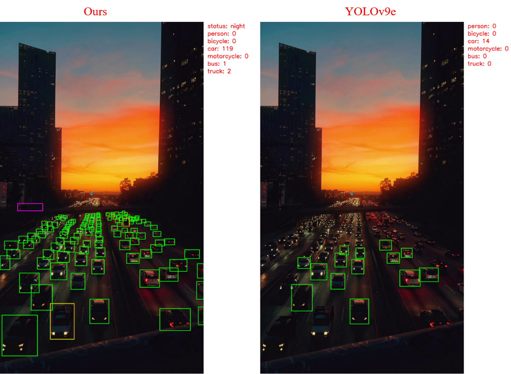
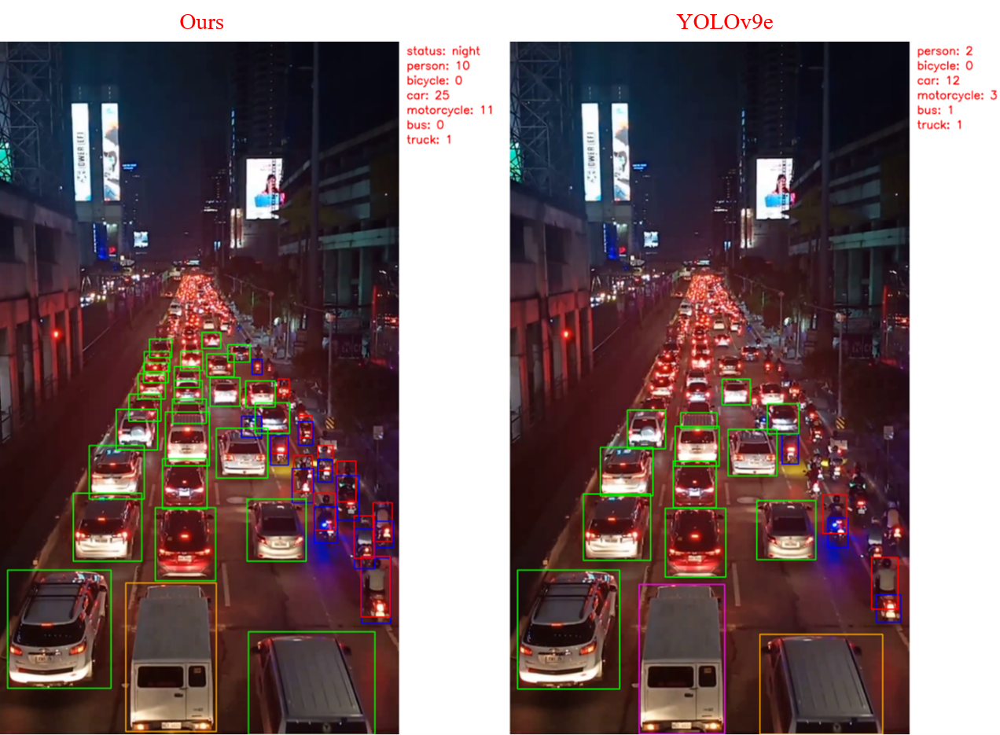
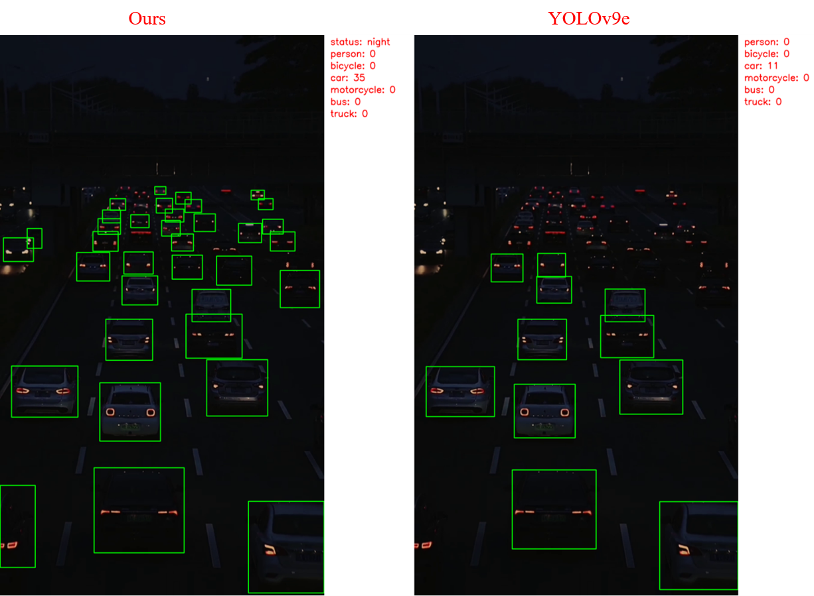
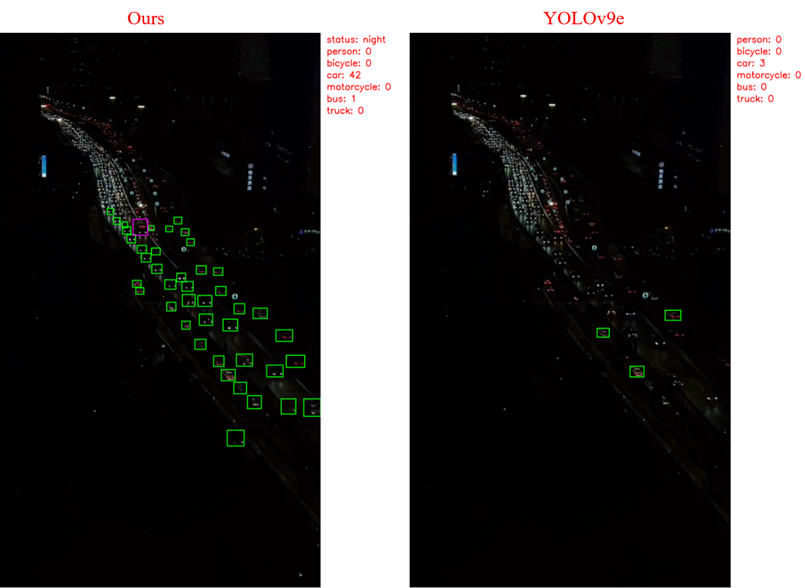
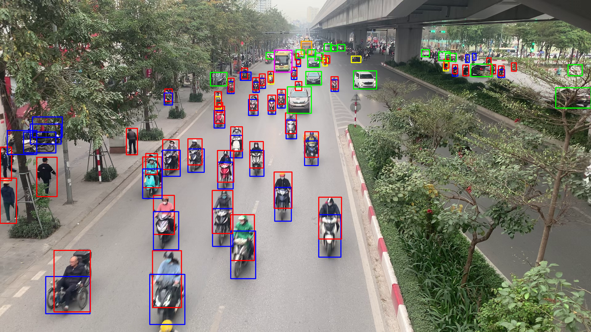
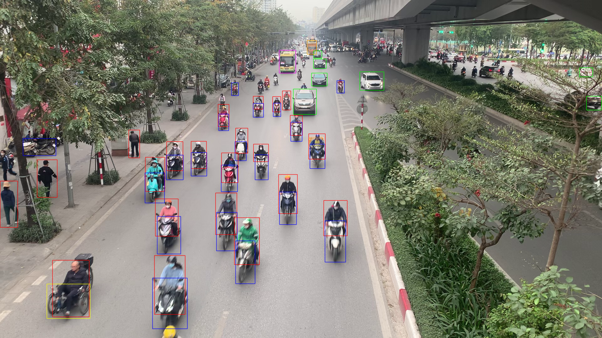

# All-day-vehicle-detection

This repository is used for detecting vehicles both during the day and at night

## Description
- This repository is used for detecting vehicles both during the day and at night using [an enhanced version of the YOLOv5 model](https://github.com/cv516Buaa/tph-yolov5) and the [EnlightenGAN model](https://github.com/VITA-Group/EnlightenGAN) for improved lighting conditions. Currently, we use the EfficientNetB0 classification model to distinguish between day and night weather conditions. Previously, we used it to classify other weather conditions such as rain. You can replace this with simpler algorithms to save computational costs, such as real-time, histogram-based methods, etc
- In this project, we use the TPH-YOLOv5 model retrained on the VisDrone dataset along with additional datasets such as ExDark, ACDC, and our custom data (which you can retrain). For the EnlightenGAN model, we use the author's pre-trained weights
- We provide pre-trained weights for [TPH-YOLOv5](weights/yolo/best.pt), [EnlightenGAN](weights/enlightening/200_net_G_A.pth), and [EfficientNetB0](weights/efficientnet/best_weights_256x256_v2.pt)
- 6 Classes: person, bicycle, car, motorcycle, bus, truck 

## Note
My code is running slower than the previous time I tested it. It will be improved in the near future.

## Install

```bash
$ git clone https://github.com/manhcuong02/All-day-vehicle-detection.git
$ cd All-day-vehicle-detection
$ pip install -v -e .
```

# Runs

```bash
python3 main.py --source your_video_path \
     --device cuda \ # ["cuda", "cpu"]
     --weights weights/yolo/best.pt \
     --imgsz 1536 \ # [1280, 1536, 1996]
     --scale_factor 1 \
     --vid_stride 1 \
     --conf_thresh 0.25 \
     --iou_thresh 0.45 \
     --savedir your_save_dir \ # or None
     --hide_labels \
     --hide_conf \
     --histogram_thresh 25 \
     --night_histogram_ratio 0.6
```

# Results
Below are some comparison results under nighttime conditions between our method (left) and the YOLOv9e model (right).






Below are some comparison results under daytime conditions between our method and the YOLOv9e model.

- Ours method


- YOLOv9e



## conclusion
If you have a better and more diverse vehicle detection dataset (I suggest that the dataset should be captured from an aerial view rather than perpendicular to the vehicles), the results will be improved. If you're interested, please star this repo. Thank you.

## References
Thanks to their great works
- [TPH-YOLOv5](https://github.com/cv516Buaa/tph-yolov5)
- [EnlightenGAN model](https://github.com/VITA-Group/EnlightenGAN)
